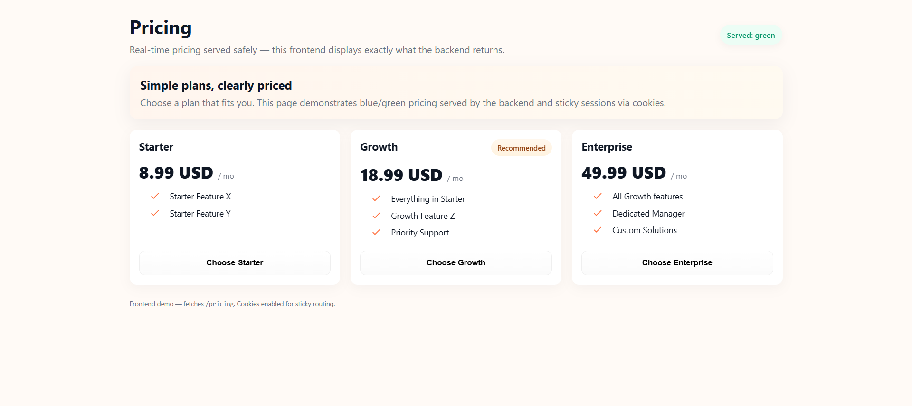

---

📦 Pricing Frontend — Blue/Green Deployment Demo

This project demonstrates a frontend pricing page connected to a mock backend that simulates blue-green deployment with sticky routing.

The frontend is built with React + Vite and the backend uses a simple Express mock server.

---

✨ Features

Responsive Pricing Page — displays pricing plans in a modern card layout.

Dynamic Data — fetches /pricing API and renders exactly what backend returns.

Version Indicator — badge shows which version (blue or green) was served.

Sticky Sessions — uses cookies to keep users on the same version across refreshes.

Routing Rules Supported:

Header-based (X-Version: blue|green)

Cookie-based sticky routing

Random split (50/50 by default)

Logging — backend logs metadata and decision for each request.

---

🚀 Getting Started

1. Clone & Install

git clone <your-repo-url>
cd pricing-frontend
npm install

2. Run the Mock Backend

node mock-server.cjs

Backend runs at:
👉 http://localhost:8080/pricing

3. Run the Frontend

In a second terminal:

npm run dev

Vite will start at a local URL such as:
👉 http://localhost:5173/ (or 5175/5176 depending on your system)

Open the URL in your browser.

---

🔍 How It Works

The first request to /pricing will be routed randomly to blue or green version.

The backend sets a version cookie so future requests stick to the same version.

Refreshing the frontend shows the same version (sticky session).

Send X-Version: blue or X-Version: green header to override manually (for testing).

---

📸 Screenshots

Desktop View

  

(This screenshot shows the Green version with 3 plans: Starter, Growth, and Enterprise.)

Mobile View

No direct mobile screenshot is provided.

The UI is fully responsive and can be previewed in Chrome DevTools mobile emulator (Ctrl+Shift+M).

---

📂 Project Structure

pricing-frontend/
├── src/                 # React frontend code
│   ├── App.jsx          # Main app with pricing fetch & UI
│   ├── App.css          # Styles
│   ├── index.css        # Global styles
│   ├── main.jsx         # React entry point
├── mock-server.cjs      # Mock backend (blue/green routing)
├── package.json         # Project dependencies & scripts
├── README.md            # Documentation
├── .gitignore           # Ignore node_modules, dist, env, etc.
├── vite.config.js       # Vite config
├── index.html           # Base HTML

---

⚡ Tech Stack

Frontend: React 19 + Vite

Backend: Express + Cookie Parser

Styling: Custom CSS (responsive grid layout)

---

📝 Notes

This project is for demonstrating blue-green deployment routing in a frontend + backend setup.

No database is used; pricing data is loaded from JSON objects.

For sticky routing to work, frontend uses:

fetch('http://localhost:8080/pricing', { credentials: 'include' })

CORS middleware allows any frontend running on http://localhost:51xx.

---

## ✅ Submission Checklist
- [x] Responsive frontend pricing page  
- [x] Fetches data from /pricing (no client-side version toggle)  
- [x] Shows served version (blue/green)  
- [x] Sticky sessions with cookies supported  
- [x] Clean loading & error states  
- [x] Modular React + Vite frontend code  
- [x] README with setup instructions & screenshot

---

👩‍💻 Author

Pooja — Assignment project on Blue/Green Pricing API with Configurable Routing and Frontend.